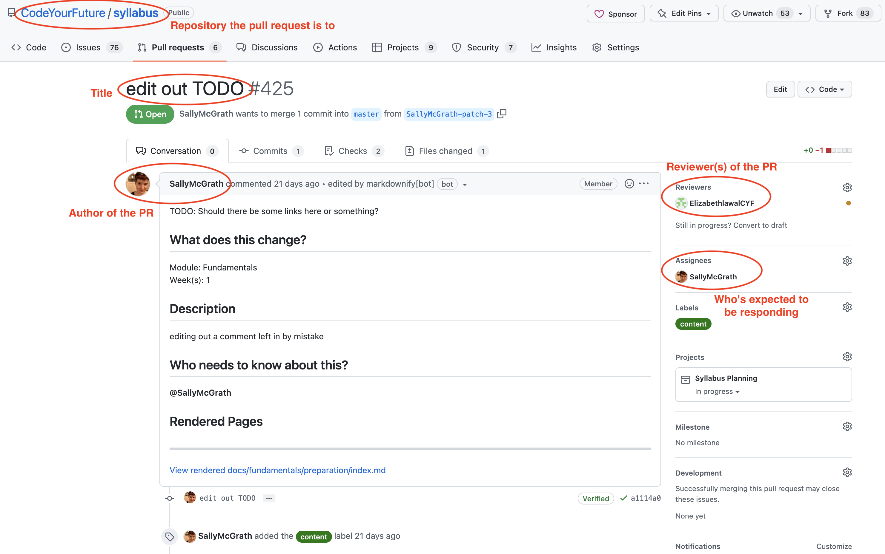

# Code Review on GitHub

Code Review is a way for an author of some code to get feedback on some code they've written.

## Roles

There are a few roles it can be useful to know about in GitHub's Code Review interface:

* **Author** - The person who wrote the code and is asking for review.
* **Reviewers** - People who are expected to give review about the code.
* **Assignees** - Different teams/projects use this field differently (and some don't at all!), but at Code Your Future we tend to use this to say who's _currently_ expected to be doing something about the pull request. So if the author is asking for comments, they should mark the reviewers as assignees. If a reviewer has left comments, and is waiting for a response, they should remove themself as an assignee, and mark the author as an assignee.

### Assigning roles

TODO: Video

## Creating a pull request

TODO: Video

## Looking at the code, and leaving comments

TODO: Video

### Leaving suggestions

TODO: Video

## Responding to comments

TODO: Video

### Accepting suggestions

TODO: Video
